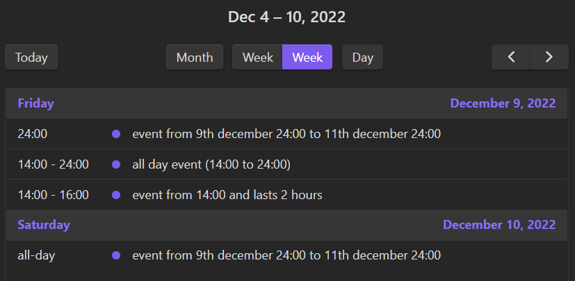
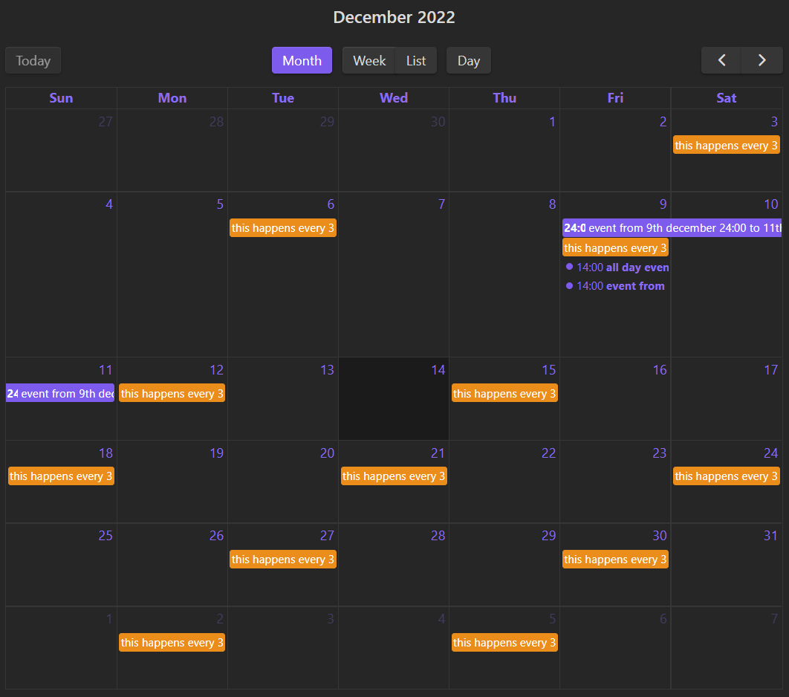

# Set In Obsidian Plugin
Plugin that allows time planning in obsidian

> **WARNING:** Plugin should be considered beta software until version 1.1.x is released

*Made as a simpler replacement for [obsidian-day-planner](https://github.com/lynchjames/obsidian-day-planner)*

## Quick Usage Guide
The plugin looks for date in [ISO 8601](https://en.wikipedia.org/wiki/ISO_8601) format inside inline code backticks at beginning of any list item, here are some examples of the syntax:

```
- `2022-12-09T14:00` all day event (14:00 to 24:00)
- `2022-12-09T14:00 PT2H` event from 14:00 and lasts 2 hours
- `2022-12-09 2022-12-11` event from 9th december 24:00 to 11th december 24:00
```

You can also make recurring events using [RRule](https://jakubroztocil.github.io/rrule/) *(iCalendar RFC string is coming in future versions)*
```
- `2022-12-01 every 3 days` happens every 3 days
```

Which would show in the list view like so:


And month view


## Incompatible Plugins
As the plugin uses [fullcalendar](https://github.com/fullcalendar/fullcalendar), other plugins using it may affect the look of the calendar depending on how they wrote the CSS *(for example [davish/obsidian-full-calendar](https://github.com/davish/obsidian-full-calendar))*

## Installation
**The plugin is not yet in obsidian repository**

### Manual
- Download latest plugin archive from [here](https://github.com/sandorex/set-in-obsidian-plugin/releases/latest/download/set-in-obsidian.zip) and extract into `.obsidian/plugin/`
- Enable the plugin in community plugins in settings

## Huge Thanks To
- [fullcalendar developers](https://github.com/fullcalendar/fullcalendar)
- Stackoverflow
- Peeps at [obsidian discord](https://discord.com/invite/obsidianmd)

## Support Me
If you find this plugin useful consider tipping so that my brain gives me some happy chemicals

[](https://ko-fi.com/C0C7GVMY1)
