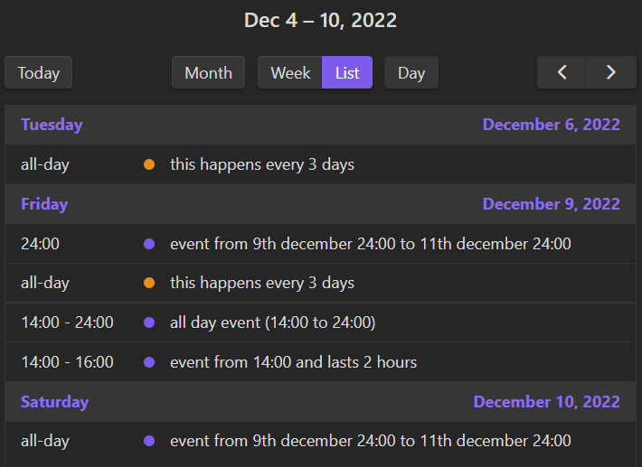

# Set In Obsidian Plugin

Plugin that allows time planning in obsidian

> **WARNING:** Plugin should be considered beta software until version 1.1.x is
> released

_Made as a simpler replacement for
[obsidian-day-planner](https://github.com/lynchjames/obsidian-day-planner)_

## Quick Usage Guide

The plugin looks for date in [ISO 8601](https://en.wikipedia.org/wiki/ISO_8601)
format inside inline code backticks at beginning of any list item, here are some
examples of the syntax:

```
- `2022-12-09T14:00` all day event (14:00 to 24:00)
- `2022-12-09T14:00 PT2H` event from 14:00 and lasts 2 hours
- `2022-12-09 2022-12-11` event from 9th december 24:00 to 11th december 24:00
```

You can also make recurring events using
[RRule](https://jakubroztocil.github.io/rrule/) _(iCalendar RFC string is coming
in future versions)_

```
- `2022-12-01 every 3 days` happens every 3 days
```

Which would show in the list view like so:


And month view 

### Embedding The Calendar

You can embed the calendar in your notes using codeblocks with `set-in-obsidian`
as the language

````markdown
```set-in-obsidian
{
	...optional json options...
}
```
````

**NOTE: you do not need the `{}` at all, it can be empty for default options**

There are several predefined options

- `set-in-obsidian` same as the calendar view
- `set-in-obsidian-custom` same as calendar view but without global events, use
  `events` or `files` to point to files which will be read (override
  `set-in-obsidian-ignore`), set `useThisFile` to get events from the source
  file
- `set-in-obsidian-minimal` minimal UI, no global calendar, blank slate
  basically

For options available check out `EmbeddedCalendarOptions` in
[src/calendar.ts](src/calendar.ts)

## Public API

This plugin has public API, currently it only exposes access to
[FullCallendar API](https://fullcalendar.io/docs#toc) which should allow other
plugins to use the calendar too

**Any function marked `@public` should be considered public API**

## Incompatible Plugins

As the plugin uses [fullcalendar](https://github.com/fullcalendar/fullcalendar),
other plugins using it may affect the look of the calendar depending on how they
wrote the CSS _(for example
[davish/obsidian-full-calendar](https://github.com/davish/obsidian-full-calendar))_

## Installation

### Inside Obsidian

You can install this plugin from within Obsidian by doing the following:

- Open settings and go to `Community plugins`
- Make sure `Safe mode` is **off**
- Click `Browse` under `Community plugins`
- Search for `Set In Obsidian` and click on it
- Click `Install`
- After it completes click `Enable`

### Manual

- Download latest plugin archive from
  [here](https://github.com/sandorex/set-in-obsidian-plugin/releases/latest/download/set-in-obsidian.zip)
  and extract into `.obsidian/plugin/`
- Enable the plugin in community plugins in settings

## Huge Thanks To

- [fullcalendar developers](https://github.com/fullcalendar/fullcalendar)
- Stackoverflow
- Peeps at [obsidian discord](https://discord.com/invite/obsidianmd)

## Support Me

If you find this plugin useful consider tipping so that my brain gives me some
happy chemicals

[](https://ko-fi.com/C0C7GVMY1)
